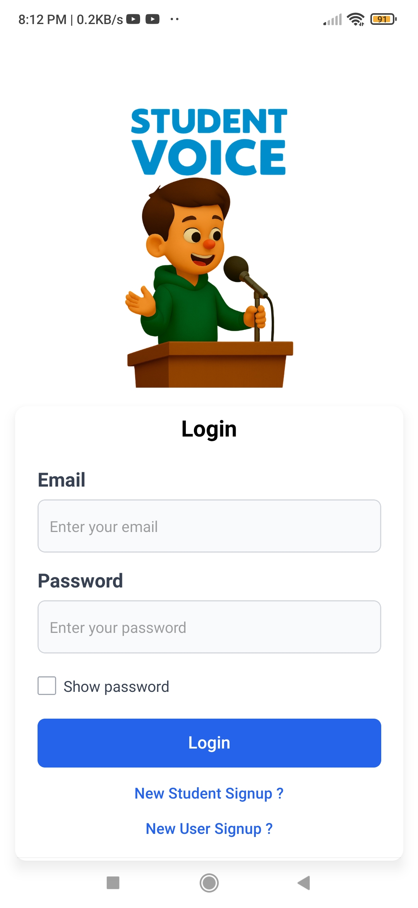
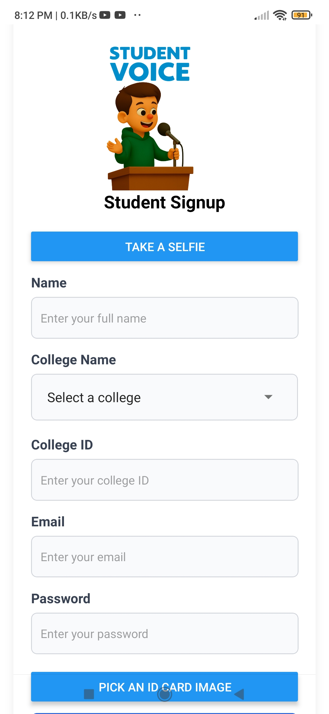
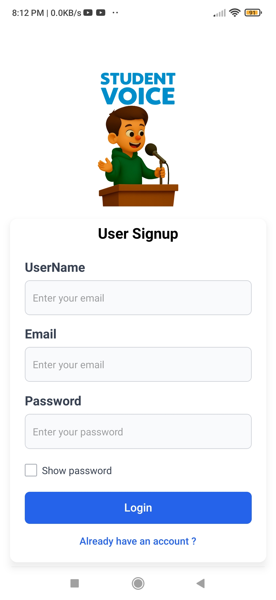
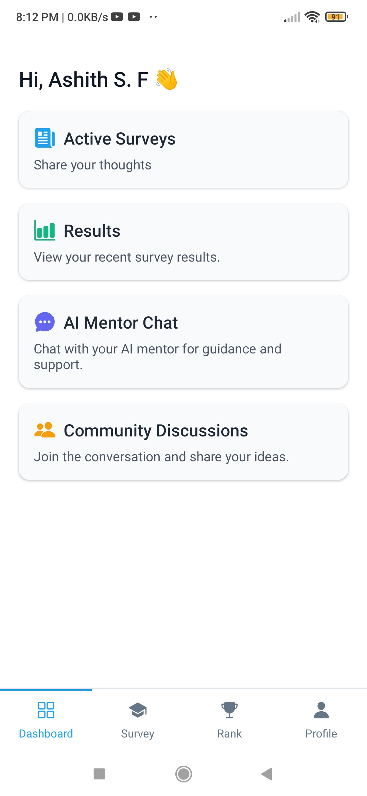
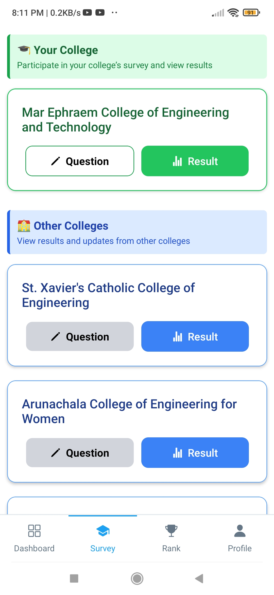
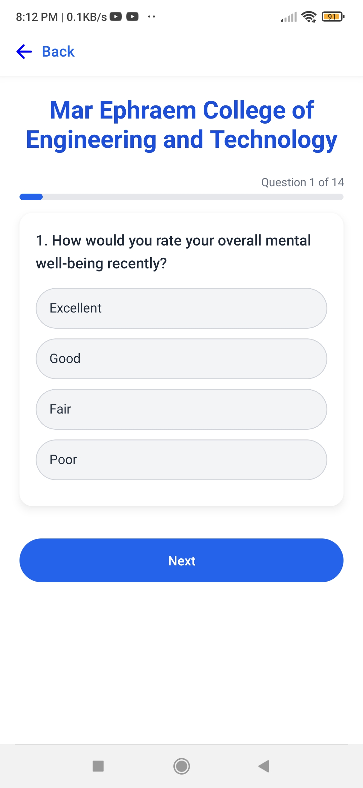
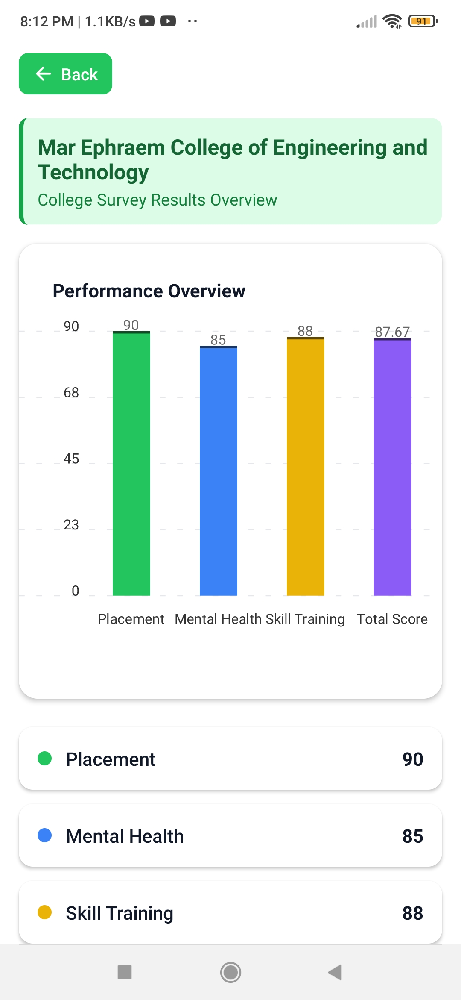
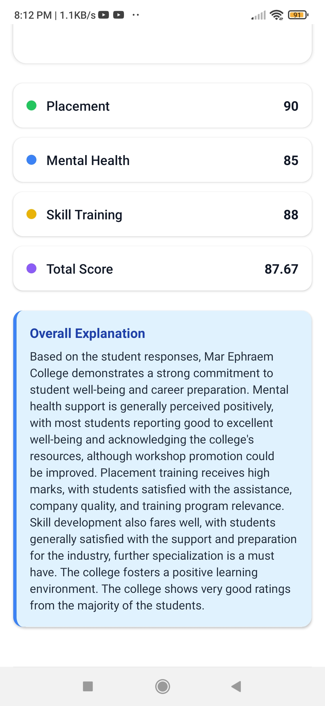
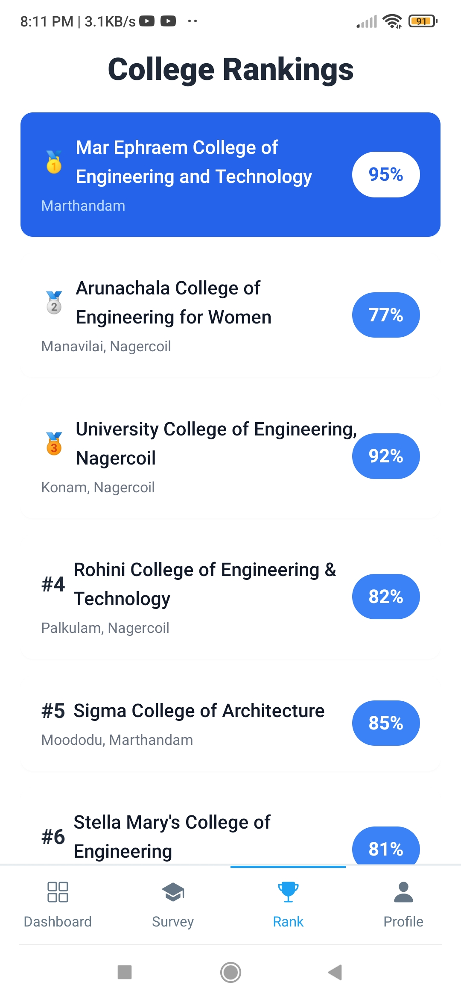
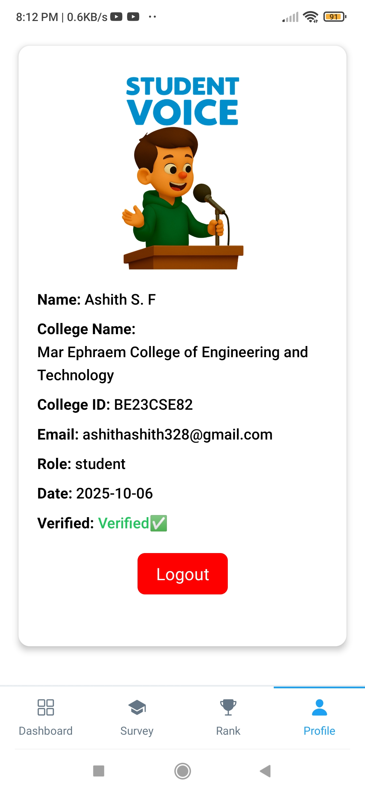

# 🎓 Student-Voice  
### AI-Powered Anonymous College Feedback & Student Support Platform  

---

## 📌 Overview  

Student-Voice is an AI-driven platform designed to replace the traditional college feedback system with a secure, anonymous, and intelligent ecosystem.

The platform enables verified students to submit honest feedback through AI-generated dynamic questions. Feedback is analyzed using AI to generate structured scores, visual insights, and explanations — while ensuring complete anonymity.

### 🎯 Platform Benefits

- 🏫 Helps colleges improve through data-driven insights  
- 🎓 Helps new students make informed admission decisions  
- 🤖 Provides AI mentorship and learning schedules  

---

## 🚨 Problem Statement  

Traditional college feedback systems suffer from:

- Static and repetitive questions  
- Fear of identity exposure  
- Biased or dishonest responses  
- Lack of actionable insights  
- No transparency for new students  

As a result, feedback becomes ineffective and does not contribute to real improvement.

---

## 💡 Proposed Solution  

Student-Voice introduces:

- ✅ Student ID + Face Verification  
- ✅ AI-generated dynamic questions  
- ✅ Anonymous feedback submission  
- ✅ AI-based score calculation  
- ✅ Graphical analytics dashboard  
- ✅ AI Mentor system  
- ✅ College comparison for public users  

> Colleges can view aggregated analytics but cannot identify individual student feedback.

---

## 📱 Application Screenshots

### 🔐 Authentication & Onboarding
| Login Screen | Student Signup (Face/ID Verification) | Public User Signup |
| :---: | :---: | :---: |
|  |  |  |

### 📋 Student Dashboard & Dynamic AI Surveys
| Student Dashboard | Survey College Selection | Dynamic AI Survey Question |
| :---: | :---: | :---: |
|  |  |  |

### 📊 AI Analytics & Performance Insights
| Performance Overview Chart | AI Insights & Detailed Explanation |
| :---: | :---: |
|  |  |

### 🏆 Rankings & Verified Profile
| College Rankings Leaderboard | Verified Student Profile |
| :---: | :---: |
|  |  |

---

## 🏗️ System Architecture  

### 1️⃣ Student Interface
- Login using Student ID  
- Face verification for authenticity  
- Answer AI-generated questions  
- Submit anonymous feedback  

### 2️⃣ Backend Server
- Authentication & verification  
- Secure feedback handling  
- Anonymity processing  
- Role-based access control  

### 3️⃣ AI Engine
- Dynamic question generation  
- Feedback analysis  
- Score calculation  
- AI-generated explanations  
- AI Mentor & learning scheduler  

### 4️⃣ Database Layer
- Secure storage of verified student data  
- Anonymized feedback storage  
- Aggregated college performance data  

### 5️⃣ Analytics Module
- Graphical dashboards  
- Comparative analysis  
- Trend monitoring  

### 6️⃣ College Admin Panel
- View aggregated analytics  
- Identify weak areas  
- Monitor performance trends  
- No access to student identity  

### 7️⃣ Public User Module
- Compare colleges  
- View overall scores  
- Make informed admission decisions  

---

## 📊 Feedback Parameters  

The system evaluates:

- 🎯 Placement Performance  
- 🧠 Mental Health Support  
- 👩‍🏫 Teaching Quality  
- 🛠 Skill Training  
- 📈 Overall College Score  

Each parameter includes:
- Numerical score  
- Graph visualization  
- AI-generated explanation  

---

## 🤖 AI Features  

### 🔹 Dynamic Question Generation  
Questions are generated based on:
- College type  
- Course category  
- Previous feedback patterns  

> No two feedback sessions are identical.

### 🔹 AI-Based Score Calculation  
- Weighted score assignment  
- Strength & weakness detection  
- Trend analysis  

### 🔹 AI Insights  
- Overall performance summary  
- Area-wise suggestions  
- Improvement recommendations  

### 🔹 AI Mentor  
- Personalized skill guidance  
- Career suggestions  
- Structured learning path  

### 🔹 AI Learning Scheduler  
- Study plan creation  
- Resource recommendations  
- Progress tracking  

---

## 🔐 Privacy & Security  

- ✔ Student verification ensures authenticity  
- ✔ Feedback stored anonymously  
- ✔ Colleges cannot map feedback to students  
- ✔ JWT-based secure authentication  
- ✔ Aggregated data visibility only  

---

## 👥 User Roles  

### 👨‍🎓 Student
- Submit feedback  
- View results  
- Access AI mentor  

### 🏫 College Admin
- View aggregated analytics  
- Analyze performance trends  

### 🌍 Public User
- Compare colleges  
- View overall scores  

---

## 🌐 Technology Stack  

### Frontend
- React Native expo  
- Tailwind CSS  
- Chart Libraries  

### Backend
- Node.js  
- Express.js  

### Database
- MongoDB  

### AI Integration
- AI Question Generator  
- AI Analysis Engine  
- AI Mentor System  

### Authentication
- Student ID validation  
- Face verification  
- JWT security  

---

## 📈 Project Impact  

### For Students
- Safe and anonymous feedback  
- Transparent college insights  
- Skill development support  

### For Colleges
- Honest performance evaluation  
- Data-driven improvements  

### For Society
- Transparent education ecosystem  
- Better admission decisions  

---

## 🚀 Future Enhancements  

- Multilingual support  
- Voice-based feedback  
- Government dashboard integration  
- Predictive ranking model  
- Mobile application  

---

## 🏁 Conclusion  

Student-Voice modernizes the student feedback ecosystem by combining:

- AI intelligence  
- Privacy-focused design  
- Real-time analytics  
- Student mentorship support  

It bridges the gap between students and institutions while ensuring trust, transparency, and security.